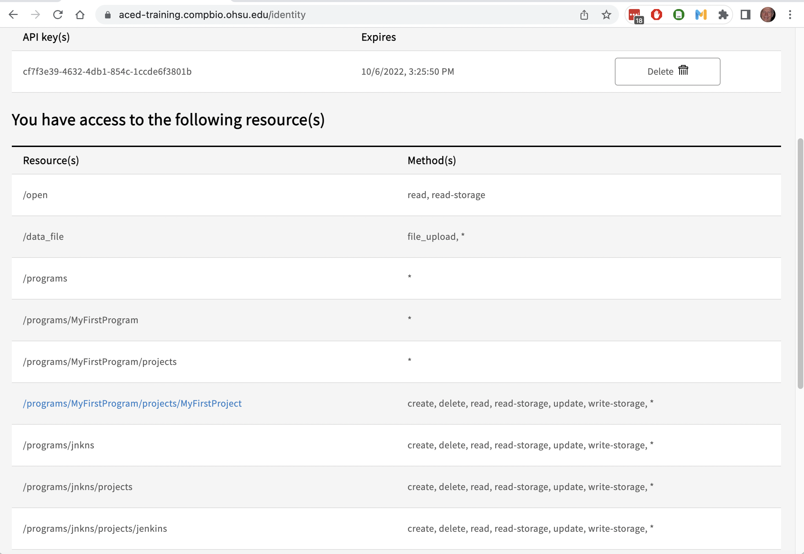
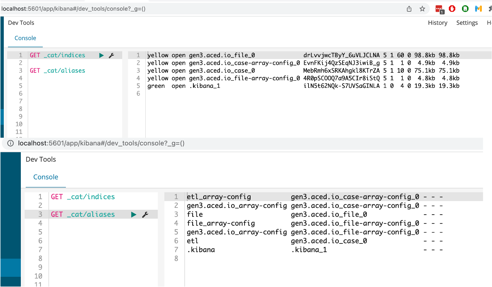
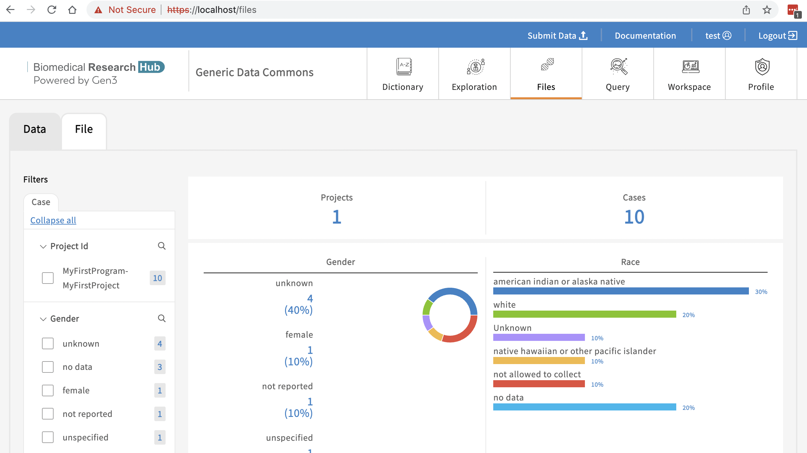

# ACED specific changes

> This document assumes you have completed setting up a 'stock' gen3 instance as described in https://github.com/uc-cdis/compose-services
> 
> Now that you've completed this task, let's explore some ACED specific customizations.


## Fence

 > Fence is the main authentication mechanism for Gen3.   Let's add some ACED specifics ...

  ## setup

  > Let's create an instance that should be hosted on  aced-training.compbio.ohsu.edu

  You should have already seen this in the compose services docs for `bash ./creds_setup.sh aced-training.compbio.ohsu.edu`

  To test locally, update your /etc/hosts file.

```
# testing
127.0.0.1  aced-training.compbio.ohsu.edu
127.0.0.1 minio.compbio.ohsu.edu
127.0.0.1 minio-console.compbio.ohsu.edu


```

  ## windmill's auth display
  
  add to Secrets/gitops.json
  ```
  "showArboristAuthzOnProfile": true,
  "showFenceAuthzOnProfile": false
  ```

   You should now see detailed authorization in the profile screen.

   
  
    

  ## migrations

  > The fence service will automatically apply a database migration on startup.   We don't want to do that every time, let's turn that off

  In Secrets/fence-config.yaml
  ```
  ENABLE_DB_MIGRATION: false   
  ```

  Now, when you re-start fence-service, you should see this message
  ```
  fence-service  | [2022-09-06 21:27:31,812][     fence][   INFO] NOT running database migration.
  ```


  ## Authentication

  > For testing, we won't configure OAuth, we will use a default user "test"

* Let's turn off auth: Secrets/fence-config.yaml#L48-L49

   ```
   # if true, will automatically login a user with username "test"
   MOCK_AUTH: true
   ```

   * Then adjust the user mapping to make the "test" user admin. In Secrets/user.yaml, change all occurrences of `username1@gmail.com` to `test`


   * Then restart fence.
     ```
     docker-compose stop fence-service ; docker-compose rm  -f fence-service ; docker-compose up -d fence-service ;
     ```

  
## certs

* If you are on an exastack node (or AWS instance) and want to use the official certificate, please ask for access:
    
  ```
  https://ohsuitg-my.sharepoint.com/ XXXXX
  ```

  * Once you have access, to install the certificate in gen3 follow these steps, assuming certs directory in ~/compbio-tls

  ```

  cp /home/ubuntu/compbio-tls/compbio-tls/compbio.ohsu.edu-2022.interim-bundle.pem  ./Secrets/TLS/service.crt
  cp /home/ubuntu/compbio-tls/compbio-tls/compbio.ohsu.edu-2022.key ./Secrets/TLS/service.key   

  ```


## Data

  * Per instructions, to disable guppy and kibana see https://github.com/uc-cdis/compose-services/blob/master/docs/setup.md#start-running-your-local-gen3-docker-compose-environment

  * Create a program (MyFirstProgram) and project (MyFirstProject).  See https://github.com/uc-cdis/compose-services/blob/master/docs/using_the_commons.md#programs-and-projects


  * Let's generate some synthetic meta data

       ```
       export TEST_DATA_PATH="$(pwd)/tests/fixtures/projects/MyFirstProject"
       mkdir -p "$TEST_DATA_PATH"
    
       docker run -it -v "${TEST_DATA_PATH}:/mnt/data" --rm --name=dsim --entrypoint=data-simulator quay.io/cdis/data-simulator:master simulate --url https://s3.amazonaws.com/dictionary-artifacts/datadictionary/develop/schema.json --path /mnt/data --program MyFirstProgram --project MyFirstProject --max_samples 10
       ```

  * Now, let's generate corresponding data files

    ```commandline
    ./etl/file --gen3_credentials_file <your-credential-file>  upload --project_path tests/fixtures/projects/MyFirstProject/
    ```


  * Load the data manually by following the [instructions](https://gen3.org/resources/user/submit-data/#begin-metadata-tsv-submissions)
        (Note that the data we will be using is in JSON form.) This will be a good opportunity to discover data dependency order. Navigate to the "Submit Data" page. Load the data, following the hierarchy displayed in the "Toogle View"

    

    * When complete, the graph should look like this.
      
      


## API

This may be a good time to examine the Gen3 API.  You will need an API key first.


For example, view the `metadata` script, where `credentials.json` is the key file downloaded above.

List the schema entities: 

```commandline

./etl/metadata --gen3_credentials_file credentials.json ls  | jq .

    {
      "programs": {
        "MyFirstProgram": [
          "MyFirstProject",
          "MySecondProject"
        ]
      },
      "entities": [
        "program",
        "project",
        "acknowledgement",
        "core_metadata_collection",
        "experiment",
        "keyword",
        "publication",
        "experimental_metadata",
        "submitted_copy_number",
        "case",
        "demographic",
        "diagnosis",
        "sample",
        "exposure",
        "family_history",
        "clinical_test",
        "aliquot",
        "slide",
        "treatment",
        "slide_image",
        "submitted_methylation",
        "read_group",
        "slide_count",
        "submitted_aligned_reads",
        "submitted_somatic_mutation",
        "submitted_unaligned_reads",
        "aligned_reads_index",
        "read_group_qc"
      ]
    }

```


## Re-Enable guppy

  * (Re)Read the [documentation](https://github.com/uc-cdis/compose-services/blob/master/docs/using_the_commons.md#configuring-guppy-for-exploration-page)  
  * Rollback comment out of guppy in nginx.conf
  * Rollback comment out of kibana in docker-compose.yml
  * Run `bash guppy_setup.sh`  - this should run the spark, tube service and launch the guppy service.  
      

## Expose the kibana service

* Add the kibana path to `nginx.conf`

```commandline
+++ b/nginx.conf
@@ -276,5 +276,17 @@ http {
         location /lw-workspace/ {
             return 302 /lw-workspace/proxy;
         }
+
+        location /kibana {
+          proxy_http_version 1.1;
+          proxy_set_header Upgrade $http_upgrade;
+          proxy_set_header Connection 'upgrade';
+          proxy_set_header Host $host;
+          proxy_cache_bypass $http_upgrade;
+
+          proxy_pass  http://kibana-service:5601/;
+          rewrite ^/kibana/(.*)$ /$1 break;
+        }
+
     }
 }
```   
* add the path to docker-compose

```commandline
   kibana-service:
     image: quay.io/cdis/kibana-oss:6.5.4
     container_name: kibana-service
     environment:
       - SERVER_NAME=kibana-service
       - ELASTICSEARCH_URL=http://esproxy-service:9200
+      - SERVER_BASEPATH=/kibana
     ports:
       - 5601:5601
     networks:

```


## Refactor the spark and tube services

* Update the docker compose to disable the spark and tube service

```commandline
@@ -283,42 +287,42 @@ services:
       - fence-service
       - portal-service
       - pidgin-service
-  tube-service:
-    image: "quay.io/cdis/tube:2021.03"
-    container_name: tube-service
-    command: bash -c "while true; do sleep 5; done"
-    networks:
-      - devnet

...
```

* Run the `tube-lite` replacement of spark and tube

```commandline
./etl/tube_lite --credentials_path credentials-local.json  --elastic http://localhost:9200
```

* Alter `guppy-setup.sh` to run the tube_lite

```commandline
diff --git a/guppy_setup.sh b/guppy_setup.sh
index 559668d..5081eb1 100644
--- a/guppy_setup.sh
+++ b/guppy_setup.sh
@@ -1,16 +1,9 @@
 #!/bin/bash
 # Script to create and re-create es indices and setup guppy

-sleep 2
-docker exec esproxy-service curl -X DELETE http://localhost:9200/etl_0
-sleep 2
-docker exec esproxy-service curl -X DELETE http://localhost:9200/file_0
-sleep 2
-docker exec esproxy-service curl -X DELETE http://localhost:9200/file-array-config_0
-sleep 2
-docker exec esproxy-service curl -X DELETE http://localhost:9200/etl-array-config_0
-sleep 2
-docker exec tube-service bash -c "python run_config.py && python run_etl.py"
-
+docker exec esproxy-service curl -X DELETE http://localhost:9200/gen3.aced.*
 docker container stop guppy-service
+
+./etl/tube_lite --credentials_path $1  --elastic http://localhost:9200
+
 docker container start guppy-service

```

* Examine the results using kibana



* Examine the results in the portal




## Local Object Store (minio)


* For local host testing.

```commandline
127.0.0.1 minio-default.compbio.ohsu.edu
127.0.0.1 minio-default-console.compbio.ohsu.edu
127.0.0.1 minio-ohsu.compbio.ohsu.edu
127.0.0.1 minio-ohsu-console.compbio.ohsu.edu
127.0.0.1 minio-ucl.compbio.ohsu.edu
127.0.0.1 minio-ucl-console.compbio.ohsu.edu
127.0.0.1 minio-manchester.compbio.ohsu.edu
127.0.0.1 minio-manchester-console.compbio.ohsu.edu
127.0.0.1 minio-stanford.compbio.ohsu.edu
127.0.0.1 minio-stanford-console.compbio.ohsu.edu
```


* Add the minio.conf file to the revproxy-service
```commandline
$ git diff docker-compose.yml
diff --git a/docker-compose.yml b/docker-compose.yml
index 62c536d..0a0f03f 100644
--- a/docker-compose.yml
+++ b/docker-compose.yml
@@ -269,6 +269,7 @@ services:
       - devnet
     volumes:
       - ./nginx.conf:/etc/nginx/nginx.conf
+      - ./minio.conf:/etc/nginx/minio.conf
       - ./Secrets/TLS/service.crt:/etc/nginx/ssl/nginx.crt
       - ./Secrets/TLS/service.key:/etc/nginx/ssl/nginx.key
     ports:
```

* Add the minio configuration to `docker-compose-override.yml` 

* Start the service

  ```dc up -d ; dc logs -f minio-default```

* Examine logs

    ```
    $ dc logs  minio-default
        minio1-service  | Formatting 1st pool, 1 set(s), 2 drives per set.
        minio1-service  | WARNING: Host minio1-service:9000 has more than 1 drives of set. A host failure will result in data becoming unavailable.
        minio1-service  | MinIO Object Storage Server
        minio1-service  | Copyright: 2015-2022 MinIO, Inc.
        minio1-service  | License: GNU AGPLv3 <https://www.gnu.org/licenses/agpl-3.0.html>
        minio1-service  | Version: RELEASE.2022-09-01T23-53-36Z (go1.18.5 linux/arm64)
        minio1-service  |
        minio1-service  | Status:         2 Online, 0 Offline.
        minio1-service  | API: http://172.19.0.2:9000  http://127.0.0.1:9000
        minio1-service  | Console: http://172.19.0.2:9001 http://127.0.0.1:9001
        minio1-service  |
        minio1-service  | Documentation: https://docs.min.io  
    ```

* Verify connection

  * curl http://minio-default.compbio.ohsu.edu/minio/health/live
  * open http://minio-default-console.compbio.ohsu.edu
  * repeat for other minio-* servers

* Enable fence URL signing
    * see AWS_CREDENTIALS, S3_BUCKETS in Secrets/fence-config.yml

* Now, let's empty the project, then re-create the project end to end.

  ```commandline
  # empty the project
  ./etl/metadata --gen3_credentials_file <your-credential-file> empty --program MyFirstProgram --project MyFirstProject
  # upload the data files
  ./etl/file --gen3_credentials_file <your-credential-file>  upload --project_path tests/fixtures/projects/MyFirstProject/
  # upload the meta data
  ./etl/metadata --gen3_credentials_file <your-credential-file>  load --project MyFirstProject --program MyFirstProgram --data_directory tests/fixtures/projects/MyFirstProject/
  # re-create the elastic search indices
  bash ./guppy_setup.sh  <your-credential-file>  
  ```


TODO (remainder of doc is work in progress)
=====


## Let's setup discovery

* Update the metadata service image

```
   metadata-service:
-    image: "quay.io/cdis/metadata-service:2021.03"
+    image: "quay.io/cdis/metadata-service:1.8.0"
     container_name: metadata-service
     depends_on:
       - postgres
+    volumes:
+      # /env/bin/python /src/src/mds/populate.py --config /var/local/metadata-service/aggregate_config.json
+      - ./Secrets/metadata/aggregate_config.json:/var/local/metadata-service/aggregate_config.json
     environment:
       - DB_HOST=postgres
       - DB_USER=metadata_user
       - DB_PASSWORD=metadata_pass
       - DB_DATABASE=metadata
+      - USE_AGG_MDS=true
+      - GEN3_ES_ENDPOINT=http://esproxy-service:9200
     command: >
```


* Update gitops.json

    See example/Secrets