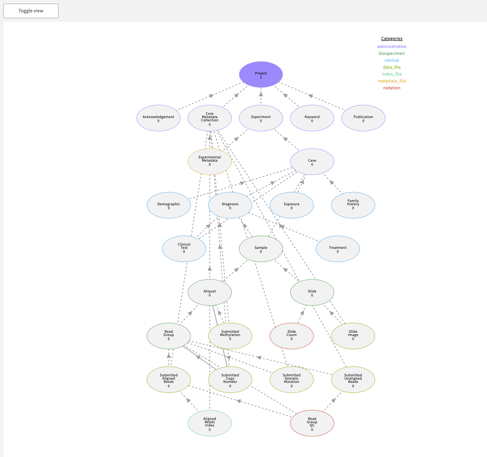

# ACED specific changes


## Fence

  ## setup

  See compose services docs for `bash ./creds_setup.sh aced-training.compbio.ohsu.edu`

  ## windmill's auth display
  
  add to gitops.json
  ```
  "showArboristAuthzOnProfile": true,
  "showFenceAuthzOnProfile": false
  ```

  ## migrations
  In Secrets/fence-config.yaml
  ```
  ENABLE_DB_MIGRATION: false 
  ```

  ## Authentication

  * Let's turn off auth: Secrets/fence-config.yaml#L48-L49

        ```
        # if true, will automatically login a user with username "test"
        MOCK_AUTH: true
        ```

        * Then adjust the user mapping to make the "test" user admin. In Secrets/user.yaml, change all occurances of `username1@gmail.com` to `test`


        * Then restart fence.

        ```
        docker-compose stop fence-service ; docker-compose rm  -f fence-service ; docker-compose up -d fence-service ;
        ```

  ## certs

    If you are on an exastack node (or AWS instance):
    
    ohsu intranet wild card cert
    https://ohsuitg-my.sharepoint.com/:f:/g/personal/walsbr_ohsu_edu/ElinLNATlvFPiI6jHp6oR04BLPnVFUT76chpbRbykJWTbQ?e=EorNnL

    * copy certs commands, assuming certs directory in ~/compbio-tls

    ```

    cp /home/ubuntu/compbio-tls/compbio-tls/compbio.ohsu.edu-2022.interim-bundle.pem  ./Secrets/TLS/service.crt
    cp /home/ubuntu/compbio-tls/compbio-tls/compbio.ohsu.edu-2022.key ./Secrets/TLS/service.key   

    ```


## Data

    * Per instructions, in disable guppy and kibana

    * Create a program and project.  See https://github.com/uc-cdis/compose-services/blob/master/docs/using_the_commons.md#programs-and-projects


    * Let's generate some data

        ```
        export TEST_DATA_PATH="$(pwd)/testData"
        mkdir -p "$TEST_DATA_PATH"

        docker run -it -v "${TEST_DATA_PATH}:/mnt/data" --rm --name=dsim --entrypoint=data-simulator quay.io/cdis/data-simulator:master simulate --url https://s3.amazonaws.com/dictionary-artifacts/datadictionary/develop/schema.json --path /mnt/data --program MyFirstProgram --project MyFirstProject --max_samples 10
        ```

    * Load the data manually by following the instructions in 
        https://gen3.org/resources/user/submit-data/#begin-metadata-tsv-submissions  (Note that the data we will be using is in JSON form.) This will be a good opportunity to discover data dependency order. Navigate to the "Submit Data" page. Load the data, following the hierarchy displayed in the "Toogle View"



## API

This may be a good time to examine the Gen3 API.  For example, view the `metadata` script.

* Note:  if testing on localhost you will need to set an enviromental variable to enable the locally generated cert  


```commandline

REQUESTS_CA_BUNDLE=$(pwd)/Secrets/TLS/ca.pem ./etl/metadata --gen3_credentials_file credentials-localhost.json ls
```

```
    $ ./etl/metadata ls | jq .
    {
      "programs": {
        "MyFirstProgram": [
          "MyFirstProject",
          "MySecondProject"
        ]
      },
      "entities": [
        "program",
        "project",
        "acknowledgement",
        "core_metadata_collection",
        "experiment",
        "keyword",
        "publication",
        "experimental_metadata",
        "submitted_copy_number",
        "case",
        "demographic",
        "diagnosis",
        "sample",
        "exposure",
        "family_history",
        "clinical_test",
        "aliquot",
        "slide",
        "treatment",
        "slide_image",
        "submitted_methylation",
        "read_group",
        "slide_count",
        "submitted_aligned_reads",
        "submitted_somatic_mutation",
        "submitted_unaligned_reads",
        "aligned_reads_index",
        "read_group_qc"
      ]
    }

```


## Re-Enable guppy

  * (Re)Read the [documentation](https://github.com/uc-cdis/compose-services/blob/master/docs/using_the_commons.md#configuring-guppy-for-exploration-page)  
  * Rollback comment out of guppy in nginx.conf
  * Rollback comment out of kibana in docker-compose.yml
  * Run `bash guppy_setup.sh`  
      

## Expose the kibana service

    * Add the kibana path to nginx.conf
```commandline
+++ b/nginx.conf
@@ -276,5 +276,17 @@ http {
         location /lw-workspace/ {
             return 302 /lw-workspace/proxy;
         }
+
+        location /kibana {
+          proxy_http_version 1.1;
+          proxy_set_header Upgrade $http_upgrade;
+          proxy_set_header Connection 'upgrade';
+          proxy_set_header Host $host;
+          proxy_cache_bypass $http_upgrade;
+
+          proxy_pass  http://kibana-service:5601/;
+          rewrite ^/kibana/(.*)$ /$1 break;
+        }
+
     }
 }
```   
    * add the path to docker-compose

```commandline
   kibana-service:
     image: quay.io/cdis/kibana-oss:6.5.4
     container_name: kibana-service
     environment:
       - SERVER_NAME=kibana-service
       - ELASTICSEARCH_URL=http://esproxy-service:9200
+      - SERVER_BASEPATH=/kibana
     ports:
       - 5601:5601
     networks:

```


## Disable the spark and tube service

* Update the docker compose to disable the spark and tube service

```commandline
@@ -283,42 +287,42 @@ services:
       - fence-service
       - portal-service
       - pidgin-service
-  tube-service:
-    image: "quay.io/cdis/tube:2021.03"
-    container_name: tube-service
-    command: bash -c "while true; do sleep 5; done"
-    networks:
-      - devnet

...
```

* Run the `tube-lite` replacement of spark and tube

```commandline
./etl/tube_lite --credentials_path credentials-localhost.json  --elastic http://localhost:9200
```

* Examine the results using kibana


* Examine the results in the portal


TODO (remainder of doc is work in progress)
=====


## Let's setup discovery

* Update the metadata service image

```
   metadata-service:
-    image: "quay.io/cdis/metadata-service:2021.03"
+    image: "quay.io/cdis/metadata-service:1.8.0"
     container_name: metadata-service
     depends_on:
       - postgres
+    volumes:
+      # /env/bin/python /src/src/mds/populate.py --config /var/local/metadata-service/aggregate_config.json
+      - ./Secrets/metadata/aggregate_config.json:/var/local/metadata-service/aggregate_config.json
     environment:
       - DB_HOST=postgres
       - DB_USER=metadata_user
       - DB_PASSWORD=metadata_pass
       - DB_DATABASE=metadata
+      - USE_AGG_MDS=true
+      - GEN3_ES_ENDPOINT=http://esproxy-service:9200
     command: >
```


